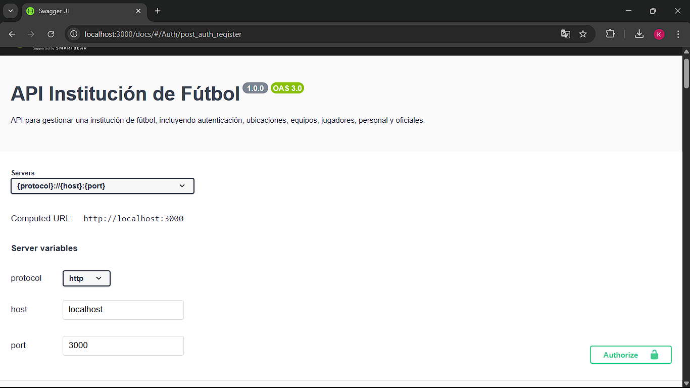
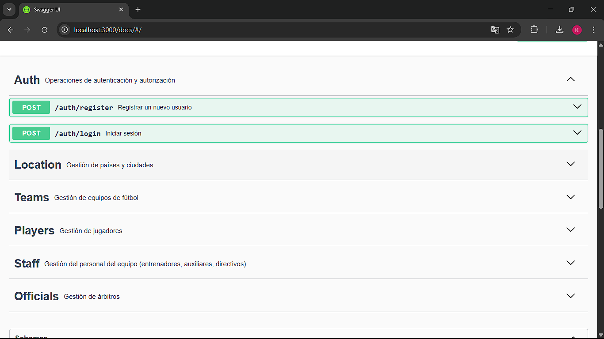
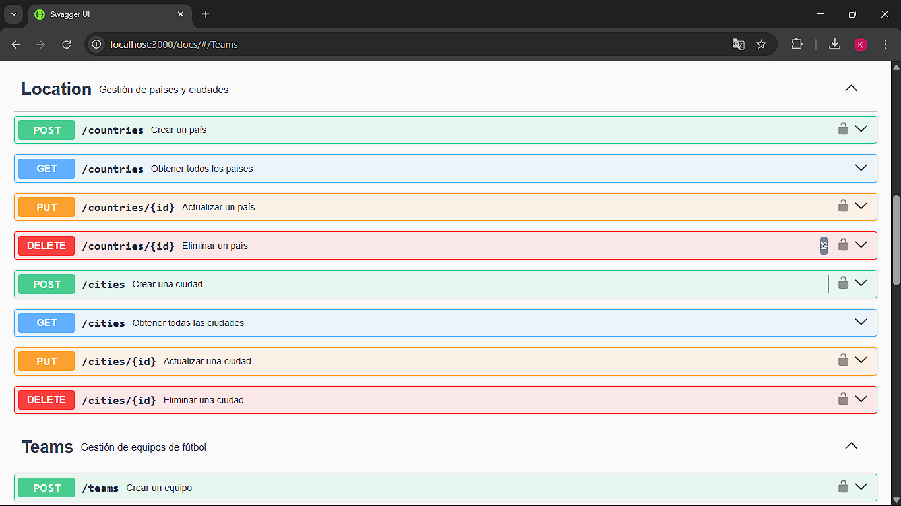
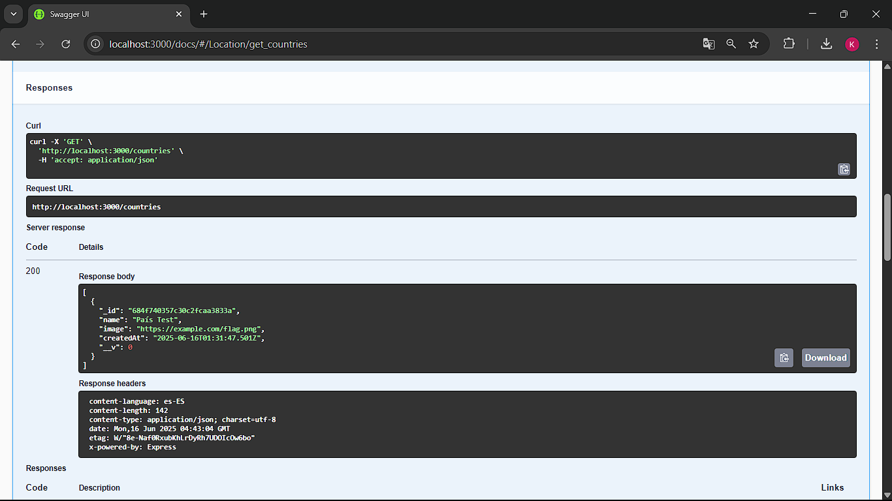
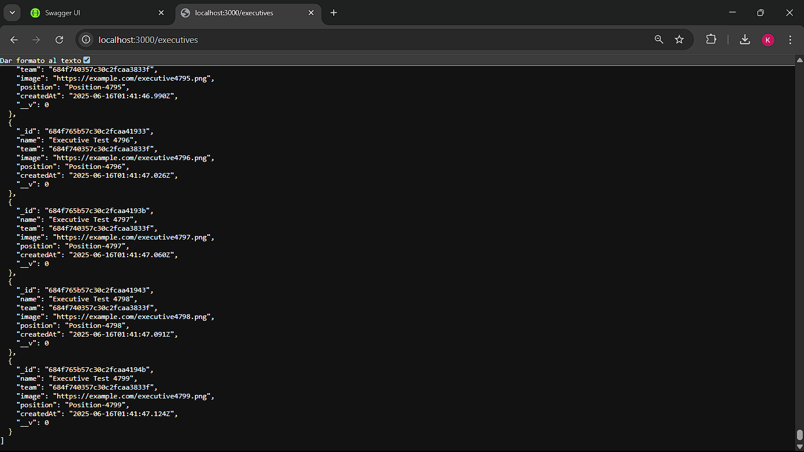

# API de Institución Deportiva de Fútbol

API REST completa para la gestión integral de una institución deportiva de fútbol. Diseñada con arquitectura moderna y siguiendo las mejores prácticas de desarrollo.

## Tabla de contenidos
- [Características principales](#características-principales)
- [Tecnologías utilizadas](#tecnologías-utilizadas)
- [Requisitos previos](#requisitos-previos)
- [Instalación y configuración](#instalación-y-configuración)
- [Guía de uso](#guía-de-uso)
- [Documentación de la API](#documentación-de-la-api)
- [Endpoints disponibles](#endpoints-disponibles)
- [Pruebas y desarrollo](#pruebas-y-desarrollo)
- [Mantenimiento](#mantenimiento)
- [¿Cómo contribuir?](#cómo-contribuir)
- [Licencia](#licencia)

## Características principales
- Sistema completo de autenticación y autorización
- Gestión de personal deportivo y administrativo
- Administración de equipos y competencias
- Panel de control intuitivo
- Documentación interactiva
- Soporte multiidioma
- Sistema de respaldo y recuperación

## Tecnologías utilizadas
- **Node.js**: Entorno de ejecución para JavaScript en el servidor.
- **Express**: Framework para construir la API REST.
- **MongoDB**: Base de datos NoSQL para almacenar los datos.
- **Mongoose**: ODM para interactuar con MongoDB.
- **Swagger**: Documentación interactiva de la API.
- **JWT**: Autenticación basada en tokens.
- **Jest y Supertest**: Pruebas unitarias y de integración.
- **i18n**: Soporte para múltiples idiomas.
- **Dotenv**: Gestión de variables de entorno.

## Requisitos previos
- Tener instalado [Node.js](https://nodejs.org/) (versión 14 o superior).
- Tener instalado [MongoDB](https://www.mongodb.com/) (versión 4.0 o superior).
- Conocimientos básicos de JavaScript y desarrollo web.

## Instalación y configuración
1. Clona el repositorio:
   ```bash
   git clone https://github.com/<tu-usuario>/FootballInstitutionAPI.git
   cd FootballInstitutionAPI
   ```
2. Instala las dependencias:
   ```bash
   npm install
   ```
3. Crea un archivo `.env` basado en `.env.example`:
   ```bash
   cp .env.example .env
   ```
4. Configura las variables de entorno en el archivo `.env` (ver [Configuración](#configuración)).
5. Inicia el servidor:
   ```bash
   npm run dev
   ```

## Configuración
Crea un archivo `.env` en la raíz del proyecto con las siguientes variables:

```env
PORT=3000
MONGODB_URI=mongodb://localhost:27017/football_institution
JWT_SECRET=tu_clave_secreta_aqui
```

- **PORT**: Puerto donde correrá el servidor (por defecto, 3000).
- **MONGODB_URI**: URI de conexión a MongoDB (ajusta si usas un servicio en la nube como MongoDB Atlas).
- **JWT_SECRET**: Clave secreta para firmar los tokens JWT (usa una cadena segura y única).

Asegúrate de tener MongoDB instalado y corriendo localmente o usa un servicio en la nube.

## Guía de uso
### Iniciar el servidor
```bash
# Modo desarrollo
npm run dev

# Modo producción
npm start
```

### Ejemplos de peticiones
```bash
# Crear nuevo equipo
curl -X POST http://localhost:3000/api/equipos \
  -H "Authorization: Bearer <tu-token>" \
  -H "Content-Type: application/json" \
  -d '{"nombre":"Real Madrid","ciudad":"Madrid","categoria":"Primera División"}'

# Obtener lista de jugadores
curl http://localhost:3000/api/jugadores
```

## Documentación de la API
La API está documentada con Swagger, lo que permite explorar e interactuar con todos los endpoints directamente desde el navegador. Accede a la documentación en:

```
http://localhost:3000/docs
```

Aquí tienes una captura de pantalla de la interfaz de Swagger:







La documentación incluye:
- Descripciones de cada endpoint.
- Esquemas de solicitud y respuesta.
- Códigos de estado esperados (200, 201, 400, 401, etc.).
- Ejemplos de payloads.
- Autenticación con JWT para endpoints protegidos.

## Endpoints disponibles
| Ruta | Método | Descripción | Autenticación |
|------|--------|-------------|---------------|
| `/auth/register` | POST | Registrar un nuevo usuario | No |
| `/auth/login` | POST | Iniciar sesión y obtener un token JWT | No |
| `/countries` | GET | Obtener todos los países | No |
| `/countries` | POST | Crear un país | Sí |
| `/countries/{id}` | PUT | Actualizar un país | Sí |
| `/countries/{id}` | DELETE | Eliminar un país | Sí |
| `/cities` | GET | Obtener todas las ciudades | No |
| `/cities` | POST | Crear una ciudad | Sí |
| `/cities/{id}` | PUT | Actualizar una ciudad | Sí |
| `/cities/{id}` | DELETE | Eliminar una ciudad | Sí |
| `/teams` | GET | Obtener todos los equipos | No |
| `/teams` | POST | Crear un equipo | Sí |
| `/teams/{id}` | GET | Obtener un equipo por ID | No |
| `/teams/{id}` | PUT | Actualizar un equipo | Sí |
| `/teams/{id}` | DELETE | Eliminar un equipo | Sí |
| `/players` | GET | Obtener todos los jugadores | No |
| `/players` | POST | Crear un jugador | Sí |
| `/players/{id}` | GET | Obtener un jugador por ID | No |
| `/players/{id}` | PUT | Actualizar un jugador | Sí |
| `/players/{id}` | DELETE | Eliminar un jugador | Sí |
| `/coaches` | GET | Obtener todos los entrenadores | No |
| `/coaches` | POST | Crear un entrenador | Sí |
| `/coaches/{id}` | PUT | Actualizar un entrenador | Sí |
| `/coaches/{id}` | DELETE | Eliminar un entrenador | Sí |
| `/referees` | GET | Obtener todos los árbitros | No |
| `/referees` | POST | Crear un árbitro | Sí |
| `/referees/{id}` | PUT | Actualizar un árbitro | Sí |
| `/referees/{id}` | DELETE | Eliminar un árbitro | Sí |
| `/assistants` | GET | Obtener todos los auxiliares | No |
| `/assistants` | POST | Crear un auxiliar | Sí |
| `/assistants/{id}` | PUT | Actualizar un auxiliar | Sí |
| `/assistants/{id}` | DELETE | Eliminar un auxiliar | Sí |
| `/executives` | GET | Obtener todos los directivos | No |
| `/executives` | POST | Crear un directivo | Sí |
| `/executives/{id}` | PUT | Actualizar un directivo | Sí |
| `/executives/{id}` | DELETE | Eliminar un directivo | Sí |

Para las rutas protegidas, incluye el token JWT en el encabezado `Authorization`:
```
Authorization: Bearer <tu-token>
```

## Pruebas y desarrollo
El proyecto incluye pruebas unitarias y de integración con Jest y Supertest. Para ejecutar las pruebas:

```bash
NODE_ENV=test npm test
```

Las pruebas cubren:
- Endpoints de autenticación (`/auth/register`, `/auth/login`).
- CRUD para países, ciudades, equipos, jugadores, entrenadores, árbitros, auxiliares y directivos.

Asegúrate de tener una base de datos de prueba configurada en `.env` (por ejemplo, `MONGODB_URI=mongodb://localhost:27017/football_institution_test`).

## Mantenimiento
### Respaldos
```bash
# Crear respaldo
npm run backup

# Restaurar desde respaldo
npm run restore
```

### Monitoreo
- Panel de estado: `http://localhost:3000/status`
- Logs: `http://localhost:3000/logs`
- Métricas: `http://localhost:3000/metrics`

## ¿Cómo contribuir?
¡Las contribuciones son bienvenidas! Sigue estos pasos para contribuir:
1. Haz un fork del repositorio.
2. Crea una rama para tu feature o corrección:
   ```bash
   git checkout -b feature/nueva-funcionalidad
   ```
3. Realiza tus cambios y haz commit:
   ```bash
      git commit -m "Añadir nueva funcionalidad"
      ```
      Si tu cambio soluciona un problema existente, referencia el número del issue en el mensaje de commit, por ejemplo:
      ```bash
      git commit -m "Corregir validación de usuario (closes #12)"
      ```
      Asegúrate de que tus mensajes de commit sean claros y descriptivos. Por ejemplo:
      - Explica brevemente el propósito del cambio.
      - Si el commit incluye varias modificaciones, resume los puntos principales.
      - Usa el idioma español para mantener la coherencia del proyecto.

      Ejemplos de buenos mensajes de commit:
      ```bash
      git commit -m "Agregar validación de email en el registro de usuario"
      git commit -m "Actualizar dependencias y mejorar documentación de instalación"
      git commit -m "Refactorizar controlador de equipos para mayor legibilidad"
      ```

      Además, antes de enviar tu Pull Request:
      - Verifica que el código pase todas las pruebas ejecutando `npm test`.
      - Asegúrate de que tu código siga las convenciones de estilo del proyecto (puedes usar herramientas como ESLint si están configuradas).
      - Si agregaste nuevas funcionalidades, incluye pruebas unitarias o de integración para ellas.
      - Actualiza la documentación (`README.md` o archivos relevantes) si tu cambio afecta el uso o la configuración del proyecto.
4. Sube los cambios a tu fork:
   ```bash
   git push origin feature/nueva-funcionalidad
   ```
5. Crea un Pull Request en GitHub.

Por favor, sigue las convenciones de código y añade pruebas para cualquier nueva funcionalidad.

## Licencia
Este proyecto está licenciado bajo la [Licencia MIT](LICENSE).